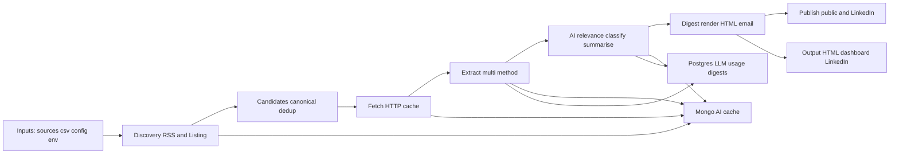

# Lloyd’s Market News Digest

Local-first news discovery + extraction + AI scoring + HTML/email digest for the London Lloyd’s Market.

## Why This Exists
The Lloyd’s market depends on timely, high-signal updates across insurers, brokers, regulators, and the broader financial press. This app automates discovery, extraction, and summarisation so teams can stay current without manually scanning dozens of sources daily.

## What It Serves
- A repeatable daily digest of Lloyd’s market news.
- A transparent, auditable pipeline with raw and processed data stored for review.
- A local-first AI workflow with optional cloud models and budget controls.

## Core Features
- Source discovery (RSS + listing pages) with candidate de-duplication.
- Robust HTTP fetching with retry and cache.
- Multi-method extraction with audit logging and method learning.
- AI relevance/classification/summarisation with cache and usage tracking.
- HTML digest rendering (internal + public) with optional SMTP delivery.
- Observability: run metrics, method health, and a local dashboard.
- Publishing and social artifacts (GitHub Pages + LinkedIn assets).

## Quick Start
1. Create a Python environment named `314` and install dependencies.
2. Copy `.env.example` to `.env` and fill in Postgres, Mongo, SMTP, and Ollama settings.
3. Ensure `config.yaml` exists in the repo root (a minimal sample is included).
4. Run a single digest:
   ```bash
   conda activate 314
   python -m lloyds_digest run --now
   ```

## Daily Run (Scheduled)
Use `scripts/run_daily.sh` for a standard daily run with environment loading.
```bash
conda activate 314
scripts/run_daily.sh
```
Typical use is via `launchd` (macOS) or `cron` (Linux) using the templates in `scripts/` and guidance in `DAY2_OPS_RUNBOOK.md`.

## Usage Steps
### One-off run
```bash
conda activate 314
python -m lloyds_digest run --now
```

### Limit candidates or sources
```bash
python -m lloyds_digest run --now --max-candidates 50
python -m lloyds_digest run --now --max-sources 20
```

### Force refresh (ignore cache)
```bash
python -m lloyds_digest run --now --force-refresh
```

### Render digest comparison (LLM providers)
```bash
python scripts/render_digest_llm_compare.py
```

### LinkedIn artifacts
```bash
python scripts/render_digest_chatgpt_linkedin.py
python scripts/render_linkedin_post.py
```

## Maintenance Steps
- **Update sources**: edit `sources.csv` and re-run discovery.
- **Rotate secrets**: update `.env` values (never commit).
- **Database hygiene**: run `scripts/db_init_postgres.sh` and `scripts/db_init_mongo.js` when schema/index changes occur.
- **Cache control**: disable cache via `LLOYDS_DIGEST__CACHE__ENABLED=false` for debugging.
- **Model changes**: update prompt files in `src/lloyds_digest/ai/prompts/` and track changes in `CHANGELOG.md`.
- **Health checks**: review run metrics and method health section in the digest or `output/dashboard/index.html`.

## Simple Architecture


## Where Things Live
- Source registry: `sources.csv`
- Configuration: `config.yaml` and `.env`
- Pipeline orchestrator: `src/lloyds_digest/pipeline.py`
- Storage: `src/lloyds_digest/storage/`
- Digest renderer: `src/lloyds_digest/reporting/digest_renderer.py`
- Scripts: `scripts/`
- Outputs: `output/`

## Troubleshooting
- **No candidates discovered**: check `sources.csv` URLs and page type (`rss` vs `listing`); verify the feed/listing is reachable.
- **Empty digest**: confirm extraction succeeded; inspect Mongo `attempts_raw` and Postgres `attempts` for failures.
- **High 403/429 rates**: update user-agent in the HTTP fetcher and reduce concurrency; some sites block aggressive fetches.
- **Mongo cache conflicts**: ensure cache key uses canonical URL + fetcher name and avoid `$set` conflicts.
- **AI calls failing**: verify Ollama is running and model names match `config.yaml` or env overrides.
- **Digest render errors**: validate prompt files and any HTML templates; check `output/` permissions.
- **run_daily.sh fails**: confirm `.env` is sourced and conda env `314` is active in the scheduler context.

## Phase History
See `phases.md` for the original phase-by-phase implementation plan.
